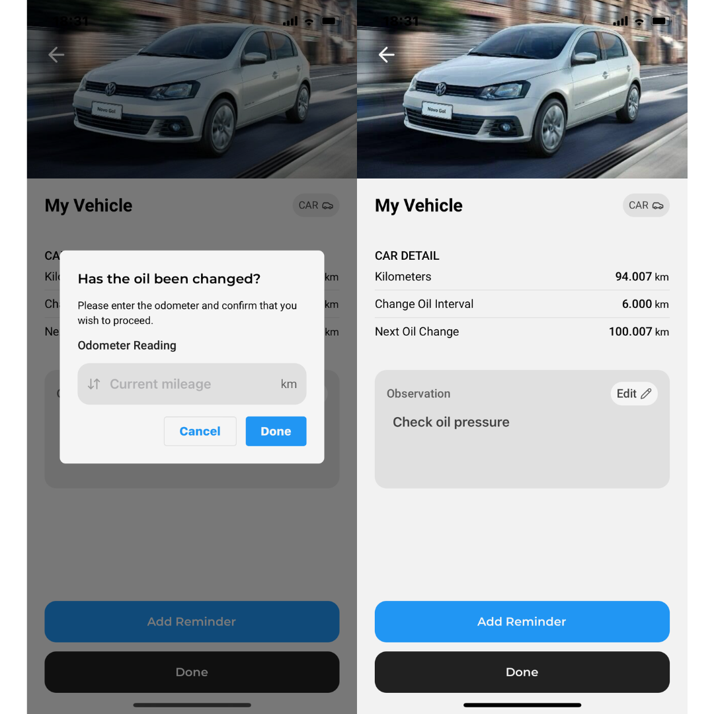
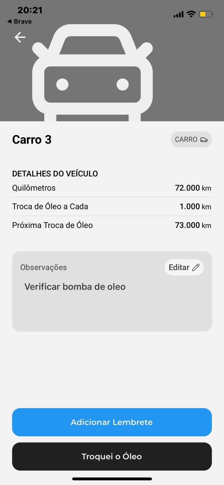
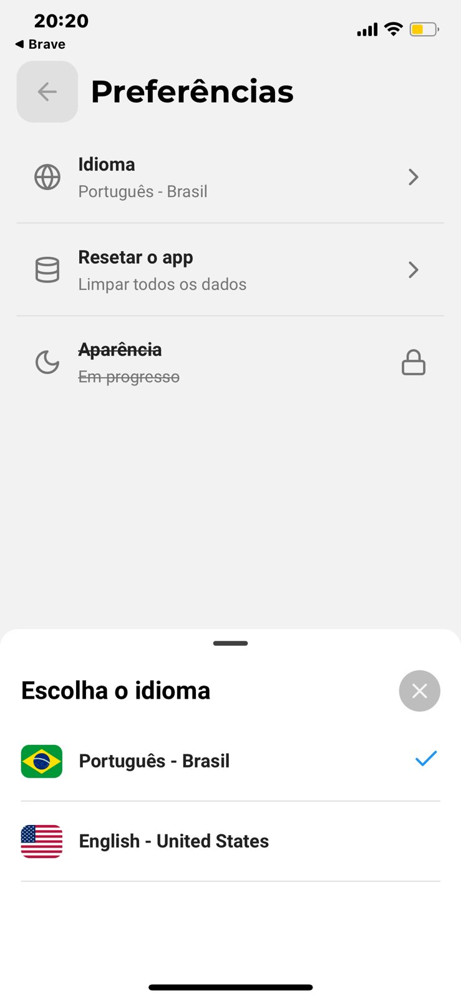

# Oil Reminder 🚗

**Oil Reminder** é um aplicativo desenvolvido para auxiliar proprietários de veículos a manterem a manutenção em dia. Com ele, você pode registrar a quilometragem atual, definir intervalos de troca de óleo e configurar lembretes para nunca mais esquecer de cuidar do seu veículo!

### Tela Inicial
<div style="display: flex; gap: 10px;">
  
  
</div>

### Tela do Veículo
<div style="display: flex; gap: 10px;">
  
</div>

### Tela de Configurações
<div style="display: flex; gap: 10px;">
  
  
</div>

Confira a primeira build 1.0 disponível para download:

- **[Baixar pelo site oficial](https://oilreminder.vercel.app/)**
- **[Download pelo GitHub](https://github.com/matheudsp/oil-reminder/releases/tag/1.0)**

## ✨ Funcionalidades

- **Registro de Quilometragem:** Insira a quilometragem atual do veículo.
- **Intervalo de Troca de Óleo:** Defina quando o próximo serviço de troca de óleo será necessário.
- **Lembretes no Calendário:** Agende facilmente um lembrete para a próxima troca de óleo.
- **Interface Intuitiva:** Simples e eficiente para todos os tipos de motoristas.

## 🚀 Tecnologias Utilizadas

- **React Native & Expo**: Para desenvolvimento e distribuição do app.
- **Async Storage**: Para armazenar localmente as informações dos usuários.
- **i18n-js**: Implementação de internacionalização (i18n) para suporte multilíngue.
- **Bibliotecas de UI**: Utilização de componentes estilizados para experiência otimizada de usuário.

## 🛠️ Instalação e Execução Local

Para rodar o Oil Reminder localmente em modo de desenvolvimento, siga os passos abaixo:

### Pré-requisitos

- Node.js instalado (versão 14 ou superior).
- Expo CLI (executar `npm install -g expo-cli` caso ainda não tenha).

### Passo a Passo

1. Clone o repositório:
   ```bash
   git clone https://github.com/matheudsp/oil-reminder.git
   cd oil-reminder
Instale as dependências:

bash
Copiar código
npm install
Inicie o servidor Expo:

bash
Copiar código
expo start
Escaneie o QR code com o aplicativo Expo Go no seu dispositivo móvel para rodar o app.

📄 Licença
Este projeto está licenciado sob a licença MIT. Consulte o arquivo LICENSE para mais detalhes.

📬 Contato
Desenvolvido por Matheus de Sousa Pereira
Para mais informações ou sugestões, entre em contato via atendimentoaocliente.valedosol@gmail.com.

Contribuições e feedbacks são sempre bem-vindos! 😄
